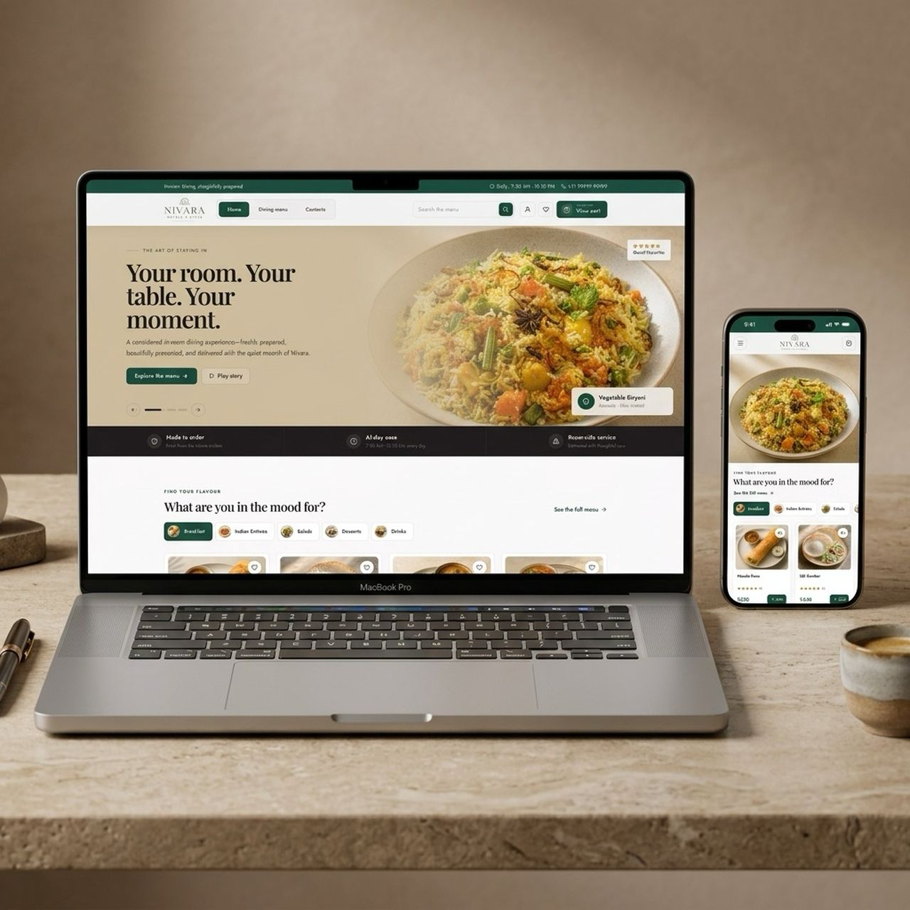

# Nivara Hotels & Stays — In-Room Dining Platform



A luxury, high-performance in-room dining and guest concierge web application built for **Nivara Hotels & Stays**. Crafted with modern web technologies, responsive layouts, and an elegant hospitality design system.

---

## Brand & Experience

**Nivara Hotels & Stays** represents refined luxury hospitality, quiet elegance, and exceptional room-side dining. The platform supports seamless menu exploration, dietary customization, real-time cart calculation, automated PDF invoice generation, and direct WhatsApp order placement for hotel guests.

---

## Key Features

### Guest Experience
- **Interactive Menu Catalogue**: Filter by categories, dietary preferences, or instant keyword search.
- **Curated Dishes & Quick View**: Detailed dish information, spice levels, allergen tags, and dynamic pricing.
- **Cart & Wishlist Management**: Local state persistence for saved items and active room orders.
- **Automated PDF Invoicing**: Instant client-side PDF invoice generation (`NIVARA-XXXXXX`) formatted with itemized line items, GST breakdown, and guest room details.
- **WhatsApp Order Integration**: Direct 1-click room service ordering sent straight to front-desk / kitchen staff.
- **Promotional Coupons**: Built-in support for discount codes (e.g. `NIVARA10` for 10% off up to ₹500).

### Admin Operations Dashboard
- **Dining Overview**: Live operational metrics for menu items, active offers, and guest satisfaction.
- **Menu Catalogue Management**: Edit dish details, pricing, stock availability, and categories.
- **Promotional Deals & Hero Stories**: Manage featured landing slides and deal highlights.
- **Guest Reviews**: Manage authentic guest feedback and testimonials.
- **User Roles & Access**: Administrator security overview.

---

## Tech Stack

- **Framework**: [Vue 3](https://vuejs.org/) (Composition API with `<script setup>`)
- **Build Tool**: [Vite 6](https://vitejs.dev/)
- **Styling**: [Tailwind CSS 4](https://tailwindcss.com/) with custom `@theme` tokens
- **Routing**: [Vue Router 4](https://router.vuejs.org/) with dynamic document title synchronization
- **Icons**: [Lucide Vue Next](https://lucide.dev/) & [FontAwesome](https://fontawesome.com/)
- **Document Generation**: [jsPDF](https://github.com/parallax/jsPDF) & [html2canvas](https://html2canvas.hertzen.com/)

---

## Project Structure

```text
├── public/
│   ├── assets/img/
│   │   ├── logo/             # Transparent brand logo assets
│   │   ├── favicon.png       # Extracted top arch emblem favicon
│   │   └── product/          # High-resolution dish & resort photography
│   └── favicon.ico           # Multi-resolution ICO favicon
├── src/
│   ├── components/           # SiteShell & AdminShell layout wrappers
│   ├── views/                # Home, Menu, Cart, Checkout, Simple & Admin views
│   ├── store.js              # Global state management & order logic
│   ├── router.js             # Route definitions & title metadata
│   └── style.css             # Tailwind v4 theme configuration & base utilities
├── data/
│   ├── products.json         # Menu catalogue dataset
│   ├── testimonials.json     # Guest reviews dataset
│   └── hero.json             # Hero slider content
└── index.html                # Main HTML entry with SEO metadata
```

---

## Getting Started

### Prerequisites
- **Node.js** (v18.0.0 or higher)
- **npm** (v9.0.0 or higher)

### 1. Installation
```bash
npm install
```

### 2. Local Development Server
Launch the development server with Hot Module Replacement (HMR):
```bash
npm run dev
```
Open your browser and navigate to `http://localhost:5173`.

### 3. Production Build
Compile and bundle production-optimized assets to the `dist/` directory:
```bash
npm run build
```

### 4. Preview Production Build
Locally preview the production build:
```bash
npm run preview
```

---

## License

© 2026 **Nivara Hotels & Stays**. All rights reserved.
